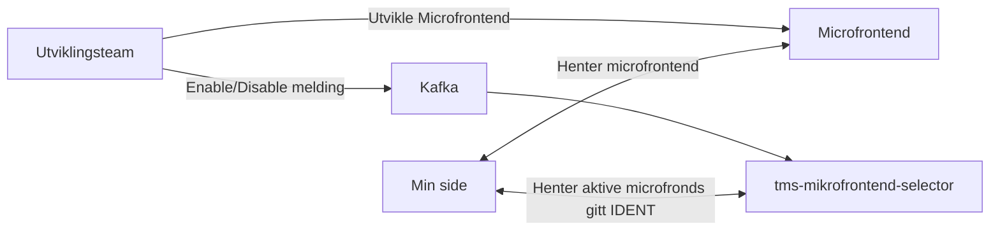

# Microfrontends på Min side

## Personalisering med microfrontends.

Min side er en dynamisk første-side for alle innloggede brukere. Målet er at innholdet på Min side skal representere brukerens nåværende forhold til Nav. For å oppnå dette, kan team legge inn microfrontends på Min side for å nå ut til sine brukere. En microfrontend kan sees på som en enkel applikasjon, som blir injektet inn på Min side. Microfrontends brukt på Min side kommer i form av små bokser med ulike funksjonalitet og innhold.

## Slik fungerer det



Figuren ovenfor er en forenklet illusterasjon av hvordan microfrontend riggen henger sammen.

## Kom i gang

Start med [templaten for server-side-rendret microfrontends](https://github.com/navikt/tms-microfrontend-template-ssr). Opprett et nytt repository basert på denne templaten, og følg instruksjonene i `README.md` for lokal kjøring, bygg og deploy.

---

### Aktivere og deaktivere microfrontends

1. **Koble til kafka topicet**
   Abonner på [min-side-microfrontend-topicet](https://github.com/navikt/min-side-microfrontend-topic-iac). **NOTE:** `microfrontendId` skal være identisk med navnet på Github-repoet du opprettet basert på templatet tidligere i guiden.

1. **Send meldinger**
   Du kan nå sende oss Enable/Disable meldinger via Kafka for å skru aktivere/deaktivere microfrontenden for spesifikke brukere.

#### Meldingsformat

```json
// Enable
{
    "@action": "enable",
    "ident": <ident for bruker: fnr/dnr>,
    "microfrontend_id": <microfrontendId>,
    "sensitivitet": <nivå som kreves for å se innholdet i mikrofrontenden, gyldige verdier: substantial og high>,
    "@initiated_by": <ditt-team>
}
```

```json
// Disable
{
    "@action":  "disable",
    "ident": <ident for bruker: fnr/dnr>,
    "microfrontend_id": <microfrontendId>,
    "@initiated_by":<ditt-team>
}
```

---

**Tips** Et meldingsbygger-bibliotek finnes på [Github packages](https://github.com/navikt/tms-mikrofrontend-selector/packages/1875650)

---

#### Hva er sensitivitet?

`sensitivitet` samsvarer med [ID-portens ACR-verdier](https://docs.digdir.no/docs/idporten/oidc/oidc_protocol_id_token#acr-values).

|     Verdi     | Når brukes den?                                  |
| :-----------: | :----------------------------------------------- |
|    `high`     | Innhold krever innlogging med idporten-loa-high. |
| `substantial` | Innhold kan vises uavhengig av innloggingsnivå.  |

Hvis feltet utelates, antar systemet `high`. Logger brukeren inn med `idporten-loa-substantial` og det finnes microfrontends som krever `idporten-loa-high`, får brukeren tilbud om «step-up»-innlogging. Se også [NAIS-dokumentasjonen om security levels](https://docs.nais.io/security/auth/idporten/#security-levels).

## Rettningslinjer

For å sikre en helhetlig brukeropplevelse på tvers av ulike type innhold på Min side, stiller vi visse krav til både innhold i- og utforming av microfrontends. Tabellen under viser en oversikt over disse rettningslinjene.

|     Tema     | Krav og resurser                                                                                                                                                                                   |
| :----------: | :------------------------------------------------------------------------------------------------------------------------------------------------------------------------------------------------- |
|    Språk     | Alt innhold skal finnes på bokmål, nynorsk og engelsk. Språkhåndtering er allerede rigget i templaten – se `src/language/text.ts`.                                                                 |
|    Design    | Vi stiller visse [designkrav](https://aksel.nav.no/god-praksis/artikler/retningslinjer-for-design-av-mikrofrontends) til utformingen av microfrontends, for å sikre en helhetlig brukeropplevelse. |
| Dependencies | ---                                                                                                                                                                                                |
|  Analytics   | Vi bruker dekoratøren sin analyticsfunksjon - se `src/pages/[locale]/index.astro`.                                                                                                                                                                                              |

## Plassering på Min side

Min side består av tre soner der team kan plassere innhold:

|         Seksjon         | Formål                                                                                                                                                                                                                                                                                                 | Teknisk støtte          |
| :---------------------: | :----------------------------------------------------------------------------------------------------------------------------------------------------------------------------------------------------------------------------------------------------------------------------------------------------- | :---------------------- |
|      Din oversikt       | Personlig status og løpende saker relatert til brukerens nåværende forhold til Nav.                                                                                                                                                                                                                    | `kafka`                 |
|       Produktkort       | Produktkort er strengt talt ikke microfrontender, men regelbaserte lenker som peker til innloggede produktsider for ett område. Vi anbefaler heller å bruke kafka, siden dette er mer treffsikkert i forhold til brukers situasjon, men hvis kafka ikke er en mulighet kan dette være ett alternativ.  | `Kafka` & `Regelbasert` |
| Kanskje aktuelt for deg | Under kanskje aktuelt for deg skal bruker få forslag til annet innhold som kan være relevant for hen, for eksempel andre stønader eller støttetjenester en bruker kan ha rett på gitt at hen har en spesifikk ytelse. Foreløbig er det kun regelbaserte mikrofrontender som vises i den her seksjonen. | `Kafka` & `Regelbasert` |

## Lurer du på noe?

Dersom du har spørsmål, kan disse stilles i [#minside-microfrontends](https://nav-it.slack.com/archives/C04V21LT27P) kanalen på slack.
