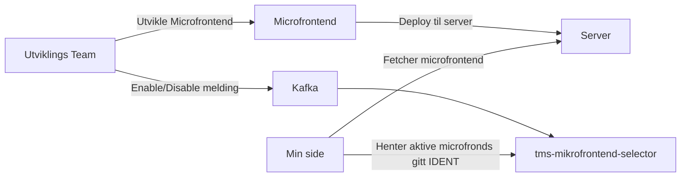

# Microfrontends på Min side

## Personalisering med microfrontends.

Min side er en dynamisk første-side for alle innloggede brukere. Målet er at innholdet på Min side skal representere brukerens nåværende forhold til Nav. For å oppnå dette, kan team legge inn microfrontends på Min side for å nå ut til sine brukere. En microfrontend kan sees på en enkel applikasjon, som blir injektet inn på Min side. Microfrontends brukt på Min side kommer i form av små bokser med ulike funksjonalitet og innhold.



## Sett opp microfrontend

Bruk [denne](https://github.com/navikt/tms-microfrontend-template) templaten og følg instruksjonene i readme-filen.

### Design

Vi stiller visse [designkrav](https://aksel.nav.no/god-praksis/artikler/retningslinjer-for-design-av-mikrofrontends) til utformingen av microfrontendene, for å ivareta en god helhetlig brukeropplevelse.

### Språk

Alt innhold må være tilgjengelig på bokmål, nynorsk og engelsk. Språkhåndtering har vi allerede satt opp [her](https://github.com/navikt/tms-microfrontend-template/blob/main/src/language/LanguageProvider.tsx).

### Dependencies

Vi deler noen dependencies på tvers av apper. Per nå er det react og react-dom. DS-css blir også delt og bør ligge på samme major versjon. Veilendende versjon ligger [her](https://github.com/navikt/tms-min-side/blob/main/index.html).

### Amplitude

Amplitude fungerer som vanlig (se [AAP sin mikrofrontend](https://github.com/navikt/aap-min-side-microfrontend/blob/main/src/utils/amplitude.ts)). Dere kan fritt logge de eventene dere vil, men for at vi skal kunne foreta målinger for Min side som helhet er det påkrevd at trykk på mikrofrontenden sender et navigere event med feltet
`komponent: <microfrontendId>`.

Videre anbefaler vi å følge [taksonominen](https://github.com/navikt/analytics-taxonomy) i NAV.

## Toggle på microfrontend

1.  Koble på [min-side-microfrontend-topicet](https://github.com/navikt/min-side-microfrontend-topic-iac) ("microfrontendId" skal samsvare med navnet på frontendrepoet).
2.  Du kan nå sende oss Enable/Disable meldinger via Kafka for å skru av og på microfrontenden for spesifikke brukere

### Enable/disable

Om en microfrontend vises avhenger av om den er enablet for en gitt bruker. Dette setter du ved å sende en melding på
microfrontend-topicet.

### Enable-melding

Enable-melding sender du for å vise microfrontenden til en bruker.

```json
{
    "@action": "enable",
    "ident": <ident for bruker: fnr/dnr>,
    "microfrontend_id": <microfrontendId>,
    "sensitivitet": <nivå som kreves for å se innholdet i mikrofrontenden, gyldige verdier: substantial og high>,
    "@initiated_by": <ditt-team>
}
```

### Disable-melding

Disable-melding sender du for å slutte å vise microfrontenden til en bruker.

```json
{
    "@action":  "disable",
    "ident": <ident for bruker: fnr/dnr>,
    "microfrontend_id": <microfrontendId>,
    "@initiated_by":<ditt-team>
}
```

### Meldingsbygger-bibliotek

Det er tilgjengelig på [github packages](https://github.com/navikt/tms-mikrofrontend-selector/packages/1875650)

### Hva er sensitivitet?

Feltet `sensitivitet` i enablemeldingen korresponderer direkte til
de [nye acr-veridene](https://docs.digdir.no/docs/idporten/oidc/oidc_protocol_id_token#acr-values) i IDporten token.

- Om informasjonen som vises krever `idporten-loa-high` innlogging skal `sensitivitet` settes til `high`.
- Om informasjonen kan vises uavhengig av innloggingsnivå skal `sensitivitet` settes til `substantial`.

Om sensitivitet ikke er spesifisert i kafka-meldingen settes det alltid til `high` hos oss.
Om en person logger inn med `idporten-loa-substantial` og det finnes mikrofrontender som personen kan se
på `idporten-loa-high` vil bruker få beskjed om dette og link til en "stepup"
login. Se også [NAIS docs](https://docs.nais.io/security/auth/idporten/#security-levels) for mer info om acr-verdiene

## Plassering

Mikrofrontender fra team plaseres enten under seksjonen "Din oversikt", på toppen under varslene, eller nederst under "Kanskje aktuelt for deg"

### Din oversikt

I din oversikt skal bruker få spesifikk informasjon knyttet til hens forhold til NAV. Din oversikt støtter for øyeblikket kun kafkabaserte mikrofrontends.

#### Produktkort

Produktkort er strengt talt ikke mikrofrontender, men regelbaserte lenker som peker til innloggede produktsider for ett område. Vi anbefaler heller å bruke kafka, siden dette er mer treffsikkert i forhold til brukers situasjon, men hvis kafka ikke er en mulighet kan dette være ett alternativ.

### Kanskje aktuelt for deg

Under kanskje aktuelt for deg skal bruker få forslag til annet innhold som kan være relevant for hen, for eksempel andre stønader eller støttetjenester en bruker kan ha rett på gitt at hen har en spesifikk ytelse. Foreløbig er det kun regelbaserte mikrofrontender som vises i den her seksjonen.
